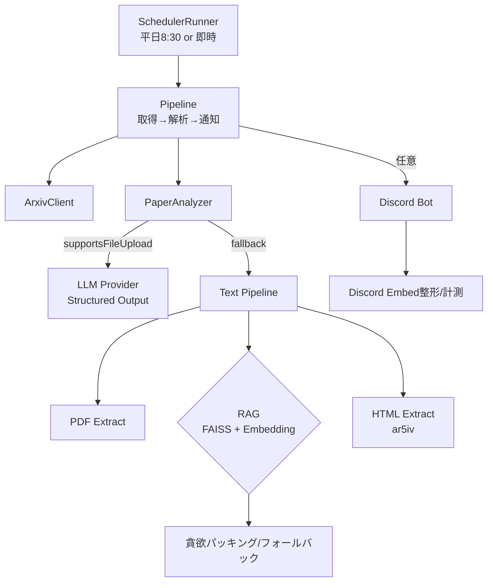

# NewPaperBot

arXivから最新の論文情報を取得し、指定されたカテゴリの論文を要約してDiscordに通知するツールです。

---

## 目次
- 概要
- 主な機能
- クイックスタート
- 環境変数（.env）
- 実行方法
- 単発解析（CLI）
- RAG 評価（オフライン CLI）
- アーキテクチャ概要
- 開発/運用（テスト・Lint・型・CI）
- トラブルシューティング
- セキュリティ
- 参考リンク

---

## 概要
- 対象: arXiv 論文の定期監視・要約・Discord通知
- 実行形態:
  - スケジューラ＋Discord Bot（平日8:30実行。即時起動フラグあり）
  - Discordなしのヘッドレス運用（ログのみ）
  - 単発解析 CLI（Discord不要）
  - RAG 取得ロジックのオフライン評価 CLI（CSV出力）
- 要件: Python 3.11 以上推奨

---

## 主な機能
- ar5iv HTML 取り込みによる高速テキスト抽出（有効時）。失敗/無効時は PDF にフォールバック
- arXivカテゴリ単位の新着取得とバッチ送信
- PDF ダウンロードと安全な処理（サイズに応じた圧縮フォールバック）
- LLM 構造化出力（summary/novelty/methodology/results/future_work/research_themes）
 - LLM 出力キーの英語スキーマへの自動正規化と厳密 JSON 指示（English keys only）
- Files API 失敗時の Text + RAG 自動フォールバック
- RAG（FAISS + Qwen Embedding）での Top-K 選択、貪欲パッキング、トップ1フォールバック
- Discord Embed の共通フォーマットとメトリクス収集
- RAG 評価 CLI でパラメータ掃引とメトリクス CSV 出力

---

## クイックスタート
1) 取得とセットアップ
```bash
git clone <YOUR_REPO_URL>
cd arxiv_analyzer
python -m venv .venv && source .venv/bin/activate  # 任意
pip install -r requirements.txt
pip install -r requirements-dev.txt  # 開発時（任意）
pre-commit install  # 任意
```

2) .env を作成（下記「環境変数」を参照）

3) 実行
```bash
python -m src.main
```

補助スクリプト（任意）:
```bash
python list_google_models.py  # 利用可能な Gemini モデル一覧の補助
```

---

## 環境変数（.env）
必須と推奨をまとめます（値はダミー）。

```ini
# --- API Keys ---
GOOGLE_API_KEY=****               # LLM_PROVIDER=gemini の場合に必須
# OPENROUTER を使う場合
# LLM_PROVIDER=openrouter
# OPENROUTER_API_KEY=****
# OPENROUTER_BASE_URL=https://openrouter.ai/api/v1  # 既定値
# LLM_MODEL=openai/gpt-4o-mini     # 例: モデルID指定が必須

# --- Discord ---
DISCORD_BOT_TOKEN=****            # Discord通知しないなら未設定でOK
DISCORD_GUILD_ID=123456789012345678  # 任意

# --- arXivカテゴリとDiscordチャンネルのペア（1..N）---
ARXIV_CATEGORY_1=cs.AI
DISCORD_CHANNEL_ID_1=123456789012345678
# 追加: ARXIV_CATEGORY_2 / DISCORD_CHANNEL_ID_2, ...

# --- RAG 設定（任意・既定あり）---
RAG_USE_FAISS=true
RAG_EMBED_MODEL=Qwen/Qwen3-Embedding-0.6B
RAG_TOP_K=6
RAG_MIN_SIMILARITY=0.2
RAG_INDEX_PERSIST=true
RAG_INDEX_DIR=cache/faiss
RAG_EMBED_CACHE=true
RAG_EMBED_CACHE_DIR=cache/embeddings

# --- HTML 取り込み（ar5iv）---
USE_AR5IV_HTML=true
AR5IV_BASE_URL=https://ar5iv.org/html

# --- LLM 共通 ---
LLM_PROVIDER=gemini                # サポート: gemini | openrouter
# Gemini は未指定時: models/gemini-2.5-flash-preview-05-20
# LLM_MODEL=models/gemini-2.5-flash-preview-05-20
LLM_TEMPERATURE=0.3
LLM_MAX_TOKENS=8192
LLM_CONTEXT_WINDOW_TOKENS=200000
LLM_THINKING_BUDGET=1024
LLM_REQUEST_TIMEOUT=60
LLM_CONCURRENCY=3
LLM_STRICT_JSON=true
LLM_USE_TOOLS=true

# --- スケジューラ ---
DEBUG_RUN_IMMEDIATELY=false        # true で即時1サイクル実行

# --- ログ ---
LOG_LEVEL=INFO
LOG_JSON=false
LOG_FILE=logs/arxiv_analyzer.log
```

備考:
- OpenRouter 利用時は `LLM_PROVIDER=openrouter` にし、`OPENROUTER_API_KEY` と `LLM_MODEL` を必ず設定。
- Gemini 利用時は `GOOGLE_API_KEY` が必須。`LLM_MODEL` 未指定でも既定が自動補完（`models/` プレフィックス）。

---

## 実行方法
スケジューラ＋Discord Bot（`DISCORD_BOT_TOKEN` 設定時）:
```bash
python -m src.main
```
- 平日8:30に `src/scheduler/runner.py` が `src/services/pipeline.py` を駆動
- カテゴリごとに新着を取得→解析→Discordへ送信

ヘッドレス（Discordなし）:
- `DISCORD_BOT_TOKEN` 未設定でも同コマンドで動作（ログ出力のみ）

Discord Bot コマンド（任意）:
- `!help` / `!status` / `!categories`

複数カテゴリの指定例:
```markdown
ARXIV_CATEGORY_1="astro-ph.CO"
DISCORD_CHANNEL_ID_1="123456789012345678"

ARXIV_CATEGORY_2="astro-ph.EP"
DISCORD_CHANNEL_ID_2="123456789012345678"
```

---

## 単発解析（CLI）
```bash
python -m src.cli.analyze_one --arxiv-id 2401.00001 --output result.json
# または PDF 指定
python -m src.cli.analyze_one --pdf-url "https://arxiv.org/pdf/2401.00001.pdf" --output result.json
```
- 最小限必要な環境変数は `GOOGLE_API_KEY`（既定は Gemini 使用）

---

## RAG 評価（オフライン CLI）
RAG パラメータ（類似度しきい値、Top-K、貪欲パッキング）を掃引し、メトリクスを CSV 出力します。

```bash
python -m src.cli.evaluate_rag --pdf-dir <PDF_DIR> \
  --min-sim 0.2 0.3 0.4 --top-k 4 8 12 \
  --out logs/eval/rag_eval.csv
```

CSV 列（例）:
```
pdf_path,n_chunks_total,min_similarity,top_k,used_top_k,filtered_count,selected_count,selected_chars,avg_score,build_ms,search_ms,fallback_used
```
- used_top_k: 段階縮小後に実使用された Top-K
- filtered_count: しきい値フィルタ後の候補数
- fallback_used: 最上位1件フォールバック使用時は 1

---

## アーキテクチャ概要


主なモジュール:
- `src/main.py`: エントリーポイント
- `src/services/pipeline.py`: 取得→解析→通知の制御
- `src/api/discord_bot.py`, `src/api/discord_format.py`: Bot と Embed 整形/メトリクス
- `src/llm/paper_analyzer.py`: ar5iv HTML 優先→失敗時 PDF、Files API→失敗時 Text/RAG フォールバック
- `src/ingestion/html_reader.py`: ar5iv HTML の取得・本文抽出と正規化
- `src/rag/embedding.py`, `src/rag/vector_store.py`: 埋め込みと FAISS
- `src/cli/analyze_one.py`, `src/cli/evaluate_rag.py`: CLI ツール

---

## 開発/運用
- テスト
```bash
pytest -q
```
- Lint/整形/型
```bash
ruff --fix .
black --line-length=100 .
mypy
```
  - pre-commit 導入済（`pre-commit install` 推奨）
- CI: `/.github/workflows/ci.yml`

---

## トラブルシューティング
- Discord チャンネルが見つからない: `.env` の `DISCORD_CHANNEL_ID_N` を数値文字列で設定
- Google API key が読めない: `.env` のパス/内容を確認。`GOOGLE_API_KEY` を設定
- 大きい PDF の処理: 50MB超は Ghostscript（`gs`）圧縮を試行（未導入時は警告してスキップ）
- FAISS/torch のインストール失敗: 環境に応じて `faiss-cpu`/`torch` バージョンを調整
- Pydantic の any 型警告: 既知の警告。必要に応じて抑制

---

## セキュリティ
- `.env` はコミット禁止（APIキーは絶対に公開しない）
- ログ/CSV に機微情報を含めない
- 外部API例はダミートークンを使用

---

## 参考リンク
- ar5iv: [ar5iv](https://ar5iv.org/)
- BeautifulSoup: [BeautifulSoup Docs](https://www.crummy.com/software/BeautifulSoup/bs4/doc/)
- lxml: [lxml](https://lxml.de/)
- arXiv API: [arXiv API](https://arxiv.org/help/api)
- Discord.py: [discord.py Docs](https://discordpy.readthedocs.io/)
- Google GenAI SDK: [Python Quickstart](https://ai.google.dev/gemini-api/docs/get-started/python)
- OpenRouter: [OpenRouter API](https://openrouter.ai/docs)
- FAISS: [FAISS](https://github.com/facebookresearch/faiss)
- Transformers: [Transformers](https://huggingface.co/docs/transformers/index)
- Pydantic Settings: [pydantic-settings](https://docs.pydantic.dev/latest/concepts/pydantic_settings/)
- Loguru: [Loguru](https://github.com/Delgan/loguru)
- pre-commit: [pre-commit](https://pre-commit.com/)
- Ruff: [Ruff](https://docs.astral.sh/ruff/)
- Black: [Black](https://black.readthedocs.io/)
- mypy: [mypy](https://mypy.readthedocs.io/)
- pytest: [pytest](https://docs.pytest.org/en/stable/)

## 停止方法

バックグラウンドで24時間毎に実行する設定になっているので、ctrl+cで停止させてください。

## 現状起こっている問題

* [ ] 出力そのものが安定しない (LLM)
* [ ] 50MB以上・1000ページ以上の論文は処理できない(LLM)
* [ ] 出力のparsing(markdownの整形)
