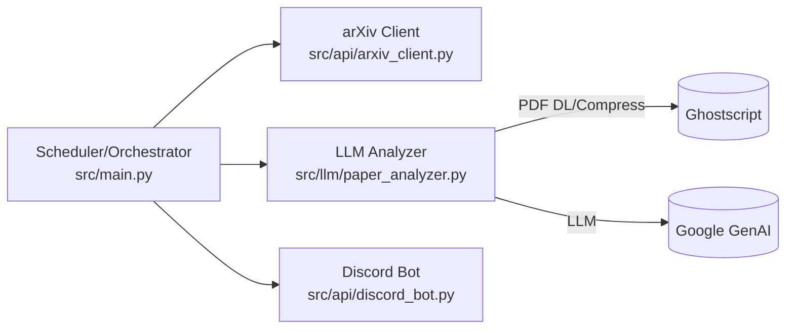
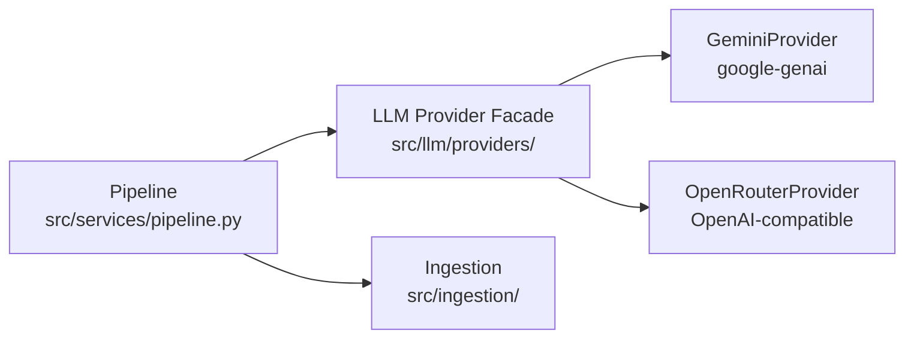

## リファクタリング・ロードマップ（arxiv_analyzer）

本ドキュメントは、可読性と保守性の向上、運用安定性の確保、将来拡張に耐える設計への移行を目的としたロードマップです。作業は段階的に進め、各フェーズでの完了基準（DoD）を明確にします。

---

### 現状把握（簡易アーキテクチャ）

- __エントリポイント__: `src/main.py` 内 `ArxivAnalyzer`
- __API層__:
  - arXiv取得: `src/api/arxiv_client.py`
  - Discord通知: `src/api/discord_bot.py`
- __LLM層__: `src/llm/paper_analyzer.py`（PDF取得/圧縮、プロンプト構築、Geminiで構造化出力）
- __モデル/スキーマ__: `src/models/paper.py`, `src/schemas/paper_analysis.py`
- __設定/ログ__: `src/utils/config.py`, `src/utils/logger.py`



### OpenRouter 前提のマルチプロバイダ化（設計追加）

OpenRouter 経由で複数モデル（Gemini/ChatGPT/Qwen 等）を切替可能にし、構造化出力（JSON）と大容量 PDF 解析を安定運用できるよう、LLM 層をプロバイダ切替式に再設計します。



- __Provider ファサード__: ベンダー差異（API/機能）を隠蔽する共通 IF を提供。
- __Ingestion__: PDF ダウンロード/圧縮/テキスト抽出/チャンク/Map-Reduce 要約を担当。
- __Pipeline__: 並列度・レート制御・再試行を集中管理。

#### 設定（`src/utils/config.py` 拡張）

- 例: `LLM_PROVIDER=openrouter|gemini`, `LLM_MODEL`, `OPENROUTER_API_KEY`, `OPENROUTER_BASE_URL=https://openrouter.ai/api/v1`
- オプション: `LLM_STRICT_JSON`, `LLM_USE_TOOLS`, `LLM_CONCURRENCY`
- バリデーション: プロバイダ毎の必須キー・モデル ID 形式を確認（OpenRouter のモデル機能差は __調査が必要__）。

#### Provider インターフェース（共通 IF）

`src/llm/providers/base.py`

```python
class BaseLLMProvider(Protocol):
    def supportsFileUpload(self) -> bool: ...
    async def generateStructuredFromFile(self, prompt: str, pdfPath: str, schema: dict, **kw) -> dict: ...
    async def generateStructuredFromText(self, prompt: str, text: str, schema: dict, **kw) -> dict: ...
    async def translate(self, text: str, **kw) -> str: ...
```

- `GeminiProvider`: 既存の `google-genai` をラップ（`response_schema`/File API）。
- `OpenRouterProvider`: OpenAI 互換エンドポイント（/chat/completions）を使用。

構造化出力の戦略（モデル依存で自動フォールバック）

1) `response_format: json_schema`（対応モデルのみ、__調査が必要__）
2) ツールコール（function calling）で `return_analysis` を強制
3) `response_format: json_object`（対応モデルのみ、__調査が必要__）
4) JSON-only 指示＋厳格バリデーション＋手動抽出

#### Ingestion（PDF の基本戦略）

- OpenRouter 経由では統一的 PDF アップロードを前提にせず、ローカル抽出＋分割要約を基本とする。
  - `src/ingestion/pdf_reader.py`: テキスト抽出
  - `src/ingestion/chunking.py`: チャンク分割（重なり）
  - `src/ingestion/summarizer.py`: Map（部分要約）→Reduce（統合要約）→Schema 変換
- `GeminiProvider` 時のみ File API による PDF 直接解析を最適経路として保持。
- Ghostscript の存在確認と安全フォールバックを実装。

#### `PaperAnalyzer` の変更点

- 役割を「プロンプト構築＋Provider 呼出」に限定し、PDF/テキスト処理は Ingestion 層へ委譲。
- 擬似フロー

```python
provider = ProviderFactory.fromSettings(settings)
if provider.supportsFileUpload():
    result = await provider.generateStructuredFromFile(prompt, pdfPath, schema_dict)
else:
    text = await pdfReader.extract(pdfPath)
    chunks = chunker.split(text)
    partials = [await provider.generateStructuredFromText(prompt, c, schema_dict) for c in chunks]
    result = reducer.combine(partials)
```

#### モデル検出と自動選択

- OpenRouter `/models` を参照し、JSON Schema/ツール可否、最大トークン等のメタをキャッシュ。
- 実行時に最適な戦略（schema → tools → json_object → fallback）を選択（対応状況は __調査が必要__）。

#### 依存とレート制御

- 追加: `openai`（OpenAI SDK）。将来: `pymupdf` 等。
- プロバイダ内部で `tenacity` によるリトライ/バックオフ、`asyncio.Semaphore` による並列制御を統一実装。

#### 導入手順（最小）

1) `src/llm/providers/` に Base/Gemini/OpenRouter のスケルトン追加
2) `src/ingestion/` に抽出/チャンク/リデュースの最小実装
3) `PaperAnalyzer` を Provider 経由に置換（Gemini 経路は温存）
4) `.env`/`config.py` を拡張（切替・キー・戦略フラグ）
5) OpenRouter で ChatGPT/Qwen/Gemini を少数試験
6) フォールバック（schema→tools→json_object→手動抽出）を検証

#### リスクとフォールバック

- モデル毎の機能差（`response_format`/tools）により、戦略分岐が必要（__調査が必要__）。
- PDF 直接添付は一般化されていないため、テキスト抽出＋分割要約を基本に置く。
- トークン制限に応じ、チャンク設定・短文化プロンプト・`max_tokens` を調整。

参考:

- OpenRouter Quickstart: [Quickstart](https://openrouter.ai/docs/quickstart)
- OpenRouter Chat Completions: [Chat completion](https://openrouter.ai/docs/api-reference/chat-completion)
- OpenRouter API Overview: [Overview](https://openrouter.ai/docs/api-reference/overview)
- OpenRouter × OpenAI SDK: [OpenAI SDK Integration](https://openrouter.ai/docs/community/open-ai-sdk)
- OpenAI Structured Outputs: [Structured outputs](https://platform.openai.com/docs/guides/structured-outputs)
- OpenAI Function Calling: [Function calling](https://platform.openai.com/docs/guides/function-calling)

---

### 進捗（2025-08-18）

- 完了: arXiv クライアントの同期 I/O を `asyncio.to_thread` で非同期化（`src/api/arxiv_client.py` の `fetch_recent_papers()` / `fetch_paper_by_id()`）。参考: [asyncio.to_thread](https://docs.python.org/3/library/asyncio-task.html#asyncio.to_thread)
- 完了: LLM 呼び出しに `tenacity` による指数バックオフのリトライを導入し、`PaperAnalyzer._call_with_retry()` から `generateStructuredFromFile`/`generateStructuredFromText` をラップ（`src/llm/paper_analyzer.py`）。参考: [Tenacity](https://tenacity.readthedocs.io/en/latest/)
- 完了: Ghostscript（`gs`）の存在確認（`shutil.which`）と失敗時フォールバック（圧縮スキップ）を実装（`src/llm/paper_analyzer.py`）。参考: [Ghostscript Docs](https://ghostscript.readthedocs.io/en/latest/)
- 完了: `research_themes` の長さ制約を Pydantic v2 の `Field(min_length=3, max_length=3)` で厳格化（`src/schemas/paper_analysis.py`）。参考: [Pydantic Issue 8771](https://github.com/pydantic/pydantic/issues/8771), [Pydantic Issue 9815](https://github.com/pydantic/pydantic/issues/9815)
- 完了: Gemini モデル名の `models/` プレフィックスを設定で強制し、既定を `models/gemini-2.5-flash-preview-05-20` に設定（`src/utils/config.py`）。参考: [Google Gen AI SDK docs](https://googleapis.github.io/python-genai/), [Generating content](https://ai.google.dev/api/generate-content)
- 完了: 単発解析 CLI（`src/cli/analyze_one.py`）を Discord 非依存で動作確認（ヘルプ起動）。
- 完了: arXiv/HTTPX の共通リトライ・タイムアウト・レートリミットを導入（`src/utils/http.py`, `src/utils/rate_limit.py`, `src/api/arxiv_client.py`, `src/llm/paper_analyzer.py`）。参考: [Tenacity](https://tenacity.readthedocs.io/en/latest/), [HTTPX](https://www.python-httpx.org/)
- 進行中: スモークテスト（`.env` 整備・依存インストール・arXiv ID/PDF URL での実行確認）。
- 未着手/今後: ログローテーション整備・共通レート制御/タイムアウト統一・OpenRouter 経路の検証・分割要約の強化・CI 導入・依存の固定・命名規約の段階移行。

---

### 進捗（2025-08-19）

- 完了: テキストRAG経路にベクトル検索（FAISS + Qwen3-Embedding-0.6B）を追加し、上位チャンク連結→単発推論→失敗時逐次チャンクのフォールバックを実装（`src/llm/paper_analyzer.py`）。参考: [FAISS](https://github.com/facebookresearch/faiss), [Qwen/Qwen3-Embedding-0.6B](https://huggingface.co/Qwen/Qwen3-Embedding-0.6B), [Transformers](https://huggingface.co/docs/transformers/index)
- 完了: 埋め込み/ベクトルストア層を分離（`src/rag/embedding.py`, `src/rag/vector_store.py`）。
- 完了: 設定を追加（`src/utils/config.py`）: `RAG_USE_FAISS`, `RAG_EMBED_MODEL`, `RAG_TOP_K`。
- 完了: 依存追加（`requirements.txt`）: `numpy`, `transformers`, `safetensors`, `faiss-cpu`, `torch`。
- 完了: pre-commit（ruff/black/mypy）・`pytest` のスモークは通過。
- 完了: プロバイダのコンテキスト超過/トークン上限エラーを自動検知し非リトライ化、RAG切替を即時化（`src/llm/paper_analyzer.py` の `_call_with_retry()`/`_is_context_overflow_error()`）。
- 完了: Files API にアップロードした一時ファイルを処理後に削除（`src/llm/providers/gemini_provider.py`）。
- 完了: FAISSインデックス永続化と埋め込みキャッシュを実装（設定: `RAG_EMBED_CACHE`, `RAG_EMBED_CACHE_DIR`, `RAG_INDEX_PERSIST`, `RAG_INDEX_DIR`。実装: `src/rag/embedding.py`, `src/rag/vector_store.py`, `src/llm/paper_analyzer.py`）。参考: [FAISS](https://github.com/facebookresearch/faiss), [Transformers](https://huggingface.co/docs/transformers/index), [NumPy](https://numpy.org/)
- TODO: RAG検索の評価（TopK/しきい値/連結長のチューニング）、RAG分岐とフォールバックの単体テスト追加。

#### 評価ワークフロー（RAG 検索チューニング）

- 完了: 評価 CLI を追加（`src/cli/evaluate_rag.py`）。`--min-sim`（類似度しきい値）/`--top-k`（上位件数）のパラメータスイープと、CSV 出力に対応。
- 使い方（例）:

```bash
python -m src.cli.evaluate_rag --pdf-dir <PDF_DIR> \
  --min-sim 0.2 0.3 0.4 --top-k 4 8 12 \
  --out logs/eval/rag_eval.csv
```

出力列: `pdf_path,n_chunks_total,min_similarity,top_k,used_top_k,filtered_count,selected_count,selected_chars,avg_score,build_ms,search_ms,fallback_used`

参考: [FAISS](https://github.com/facebookresearch/faiss), [Transformers](https://huggingface.co/docs/transformers/index), [pypdf](https://pypdf.readthedocs.io/en/stable/), [argparse](https://docs.python.org/3/library/argparse.html)

### 進捗（2025-08-22）

- 完了: ar5iv HTML 取り込みを追加し、設定で切替（`src/ingestion/html_reader.py`、`USE_AR5IV_HTML`、`AR5IV_BASE_URL`）。参考: [ar5iv](https://ar5iv.org/)
- 完了: HTTP ユーティリティに `fetchText` を追加（共通リトライ/タイムアウト/レート制御を再利用、`src/utils/http.py`）。参考: [HTTPX](https://www.python-httpx.org/)
- 完了: `PaperAnalyzer` に HTML→PDF フォールバック、LLM 出力のキー正規化（日本語/番号付き→英語キー）、`research_themes` 配列正規化、厳密 JSON 出力のプロンプト更新を実装（`src/llm/paper_analyzer.py`）。参考: [Structured Output](https://ai.google.dev/gemini-api/docs/structured-output)
- 依存追加: `beautifulsoup4`, `lxml`（HTML 解析）。参考: [BeautifulSoup Docs](https://www.crummy.com/software/BeautifulSoup/bs4/doc/), [lxml](https://lxml.de/)
- TODO: HTML 経路の E2E/単体テスト追加と PDF フォールバックの回帰確認。

### 技術的負債・課題

- __同期I/Oの混入__: （解消済み）`asyncio.to_thread` により `fetch_recent_papers()`/`fetch_paper_by_id()` を非同期化し隔離（`src/api/arxiv_client.py`）。参考: [asyncio.to_thread](https://docs.python.org/3/library/asyncio-task.html#asyncio.to_thread)
- __LLM SDKのバージョン整合性__: （一部解消）モデル名の `models/` プレフィックス強制と既定モデル設定を導入（`src/utils/config.py`）。SDK のバージョン固定と検証は未実施（`requirements.txt`）。参考: [Google Gen AI SDK docs](https://googleapis.github.io/python-genai/)
- __Ghostscript 前提__: （解消済み）`shutil.which("gs")` による存在確認と失敗時フォールバック（圧縮スキップ）を実装（`src/llm/paper_analyzer.py`）。参考: [Ghostscript Docs](https://ghostscript.readthedocs.io/en/latest/)
- __ログ設計__: 実行ごとにログファイルを削除（ローテーション機能と重複）。致命時の `sys.exit` による強制終了は長期稼働に不向き（`src/utils/logger.py`）。
- __スケジューリングの凝集度__: `ArxivAnalyzer` にスケジューラ・オーケストレーション・起動/停止処理が混在（`src/main.py`）。
- __出力安定性__: （一部解消）`research_themes` の長さ制約を厳格化（`Field(min_length=3, max_length=3)`）。JSON 抽出のユーティリティ化・テストは未。参考: [Pydantic Issue 8771](https://github.com/pydantic/pydantic/issues/8771)
- __リトライ/レートリミット__: （解消）LLM/arXiv/HTTPX に共通のリトライ（`tenacity`）・タイムアウト（`asyncio.wait_for`/HTTPX）・レート制御（QPS/セマフォ）を導入済み（`src/utils/http.py`, `src/utils/rate_limit.py`, `src/api/arxiv_client.py`, `src/llm/paper_analyzer.py`）。
- __大規模PDFの戦略不足__: >50MB は要約のみへフォールバックだが、分割要約や抽出OCR等の代替経路が未整備。
- __依存パッケージの過多__: 未使用/過剰な依存（例: `langchain`, `sqlalchemy`, `tiktoken`, `discord-py-interactions`）が混在（`requirements.txt`）。
- __命名規約のばらつき__: 変数の `camelCase` 統一（ルール）に未準拠。移行時の互換層（Pydantic alias等）未整備。
- __テスト/CIの不足__: 単体/結合/E2E テストおよび自動化が無い。

---

### フェーズ別ロードマップ

#### フェーズ 0: 足場固め（バージョンとツール）

- __依存固定__: `requirements.txt` をプロジェクトで実証済みの最小固定に更新（例）
  - `google-genai==0.8.x`（`response_schema`/`files.upload`/`aio` を前提）
  - `httpx==0.27.x`, `loguru==0.7.x`, `pydantic==2.8.x`, `pydantic-settings==2.4.x`, `python-dotenv==1.0.x`
  - `discord.py==2.4.x`, `arxiv==2.1.x`, `tenacity==8.3.x`
  - 未使用依存の削除（`langchain`, `sqlalchemy`, `tiktoken`, `discord-py-interactions` 等）
- __開発ツール__: `ruff`, `black`, `mypy`, `pytest`, `pre-commit` 導入と設定。
- __命名規約__: 変数 `camelCase`、クラス `PascalCase` の遵守方針を定義（互換のため Pydantic `alias` を活用）。

 DoD:

- 依存が固定され CI で再現ビルド可能。
- Linter/Formatter/Type-check/Test が CI で通過。

#### フェーズ 1: 設定/ログの健全化

- `src/utils/config.py`
  - `.env` 読込の単一路線化（`BaseSettings`に集約、重複ロードの整理）。
  - LLMモデル名の `models/` 接頭辞を強制（検証関数）。
  - `target_channels` のバリデーション追加（数・フォーマット）。
- `src/utils/logger.py`
  - 起動時削除を廃止し、`rotation/retention` に一元化。
  - JSONログ（オプション）や構造化フィールド（category, paperId など）を検討。

 DoD:

- ログが継続ローテートし、強制終了が除去（例外は上位でハンドル）。
- 起動時に設定バリデーションが実行され失敗時は明確なメッセージ。

#### フェーズ 2: モジュール分割と責務分離

- `src/main.py`
  - スケジューラを `src/scheduler/runner.py` に分離。
  - オーケストレータ（カテゴリ→取得→解析→通知）を `src/services/pipeline.py` に分離。
  - シャットダウン処理の統一（`asyncio.Task` 管理、`cancel`/`gather`）。
- `src/api/arxiv_client.py`
  - 同期呼び出しを `asyncio.to_thread` 経由に変更し、I/O分離。

 DoD:

- `main` は起動・終了の薄いレイヤのみ。スケジューラとパイプラインが分離。

#### フェーズ 3: 非同期・性能最適化

- LLM解析の並行度制御（`asyncio.Semaphore`）。
- arXiv取得/HTTPX/LLM に共通のリトライ（`tenacity`）とタイムアウトの一元化。
- レートリミット（全体QPS/同時実行）を設定・可視化。

 DoD:

- 大量論文でもタイムアウト/429が減少し、平均スループットが向上。

#### フェーズ 4: LLM出力の安定性

- `src/schemas/paper_analysis.py`
  - `research_themes` の長さ制約（例: `min_length=3`, `max_length=3`）。
  - 各フィールドの最大長（例: 1500–2000文字）を仕様として明文化。
- `src/llm/paper_analyzer.py`
  - プロンプトから出力形式の冗長な指定を削減（`response_schema`前提）。
  - 失敗時の再試行と、ブロック時の安全情報ログ（safety feedback）を構造化。
  - JSON抽出のフォールバックはユーティリティ化し単体テストを付与。

 DoD:

- 応答のバラつきが減少し、手動抽出の発火率が低下。

#### フェーズ 5: PDF処理の堅牢化

- `gs` の存在確認とフォールバック（圧縮スキップ/低解像度再DL など）。
- 50GBログの文言修正（現実的閾値: MB）。
- 50MB超フォールバックの強化：章単位抽出→分割要約→統合要約（将来対応）。
- （新規）テキストRAGにベクトル検索を統合：FAISS + Qwen3-Embedding-0.6B により類似チャンク上位Kを連結し単発推論。失敗時は逐次チャンク推論へフォールバック（`src/rag/embedding.py`, `src/rag/vector_store.py`, `src/llm/paper_analyzer.py`）。

DoD:

- `gs` 非導入環境でも失敗せず稼働。大容量PDFが安定処理。

#### フェーズ 6: Discord出力の整形と再利用

  - 共通モジュール `src/api/discord_format.py` を新規追加し、Embedの組み立てと整形を一元化。
    - `truncateText()`: 文字数上限で安全に省略（末尾に "..."）。
    - `formatSection()`: Markdownの強調/箇条を見やすい形に整形。
    - `buildPaperEmbed()`: 論文メタ・分析結果から Discord Embed を構築。
    - `collectEmbedMetrics()`: `fieldsCount`/`valueChars`/`truncatedFieldsCount`/`titleChars` を収集。
  - `src/api/discord_bot.py` を共通関数へ切替し、送信前に Embed メトリクスをログ出力。変数は `camelCase` に段階移行。
  - 単体テスト `tests/test_discord_format.py` を追加。
    - フィールド数・体裁（箇条書き整形）の検証。
    - 末尾が改行付きでも `collectEmbedMetrics()` が省略記号を検知することを検証。
  - 参考: [discord.py](https://discordpy.readthedocs.io/en/stable/) / Embed上限（タイトル256、説明4096、フィールド25・各値1024、合計6000 など）は Discord 仕様に準拠（要件の目安）。参考: [Discord API Docs - Message Embeds](https://discord.com/developers/docs/resources/channel#embed-object-embed-limits)

 DoD:

- 長文での崩れがなく、Embed上限を超えない。

#### フェーズ 7: テスト/CIと監視

- `pytest` による単体（スキーマ、整形、PDF処理の代替ルート、LLMパース）と結合テスト（モック）。
- GitHub Actions（例）で Lint/TypeCheck/Test を実行。
- 重要メトリクスの導入（件数、失敗率、所要時間）と可視化の足場。

 DoD:

- 主要モジュールの単体カバレッジ > 70%。CIが恒常稼働。

---

### タスク一覧（チェックリスト）

- [X] 依存の固定と不要依存の削除（フェーズ0）
- [X] Lint/Format/TypeCheck/Test/Pre-commit のCI導入（フェーズ0）
- [X] 設定/ログの健全化（フェーズ1）
- [X] スケジューラ/パイプライン分離（フェーズ2）
- [X] arXiv同期I/Oの隔離（フェーズ3）
- [X] 共通リトライ/レート制御導入（フェーズ3）
  - [X] LLM 呼び出しのリトライ（`tenacity`）導入（`PaperAnalyzer._call_with_retry`）
  - [X] LLM 同時実行制御（Semaphore）導入
  - [X] arXiv/HTTPX のリトライ・タイムアウトの統一
  - [X] レートリミット（QPS/セマフォ）導入
- [X] LLM出力スキーマ強化とフォールバック整備（フェーズ4）
  - [X] `research_themes` の長さ制約を追加（`min_length=max_length=3`）
  - [X] 文字列フィールドの最大長を 1500 に設定（`PaperAnalysisSchema`）
  - [X] Analyzer 内で JSON 抽出フォールバックとクランプ（最大長/テーマ数）を実装
- [ ] PDF処理のフォールバック強化（フェーズ5）
  - [X] Ghostscript 存在確認と失敗時フォールバック（圧縮スキップ）
  - [X] コンテキストウィンドウ推定に基づく単発/チャンク分岐（簡易RAG）
  - [X] アップロード（Files API）失敗時にテキストRAGへフォールバック
  - [X] ベクトル検索RAG（FAISS + Qwen3 Embedding）で上位チャンク連結→単発推論を実装
  - [X] プロバイダのコンテキスト超過エラー検知での自動切替
  - [X] Files API にアップロードした一時ファイルの削除（使用後に delete）
  - [X] RAG分岐とフォールバックの単体テスト追加（fits_context/チャンク結合/フォールバック経路）
  - [X] FAISSインデックス永続化と埋め込みキャッシュ（ローカル保存/読み込み）
  - [X] RAG検索の評価（トップK/類似度しきい値/連結長のチューニング）: CLI `src/cli/evaluate_rag.py` を追加し CSV 出力に対応
- [X] Discord出力整形の共通化とテスト（フェーズ6）
- [X] テスト拡充とメトリクス導入（フェーズ7）
- [X] 命名規約の段階移行（フェーズ8）
- [X] リファクタで使わなくなったファイルの削除 (フェーズ9)
 - [X] ar5iv HTML 取り込みと LLM 出力安定化
   - [X] ar5iv HTML 取得と本文抽出（BeautifulSoup + lxml）
   - [X] 設定フラグ `USE_AR5IV_HTML` と `AR5IV_BASE_URL` の追加（`src/utils/config.py`）
   - [X] `PaperAnalyzer` を HTML 優先→失敗時 PDF フォールバック対応（`src/llm/paper_analyzer.py`）
   - [X] HTTP ユーティリティ `fetchText()` の導入（リトライ/タイムアウト/レート制御、`src/utils/http.py`）
   - [X] LLM 出力キーの英語スキーマへの正規化（日本語/番号付き→英語キー）
   - [X] 厳密 JSON 出力指示（English keys only）をプロンプトに追加
   - [X] 依存追加: `beautifulsoup4`, `lxml`（`requirements.txt`）
   - [ ] テスト拡充: HTML 経路／フォールバック／キー正規化の単体・結合テスト

---

### 推奨バージョン例（要検証）

- google-genai 0.8.x
- httpx 0.27.x
- discord.py 2.4.x
- arxiv 2.1.x
- loguru 0.7.x
- pydantic 2.8.x / pydantic-settings 2.4.x
- tenacity 8.3.x

---

### 完了基準（Definition of Done）

- CIが安定稼働し、主要シナリオを自動テストで担保。
- 主要モジュールが分離され、責務が明確。
- 大量論文・大容量PDF・LLM変動に対し、失敗時の挙動が定義済みで観測可能。
- 運用時のログ/メトリクスから問題特定が容易。

---

### 参考リンク

- Google AI | Structured Output（Python対応）: [Structured Output](https://ai.google.dev/gemini-api/docs/structured-output)
- Google AI | File API: [File API Overview](https://ai.google.dev/gemini-api/docs/file_api_overview)
- google-genai Python SDK: [Python Client](https://github.com/google-gemini/generative-ai-python)
- discord.py ドキュメント: [discord.py](https://discordpy.readthedocs.io/en/stable/)
- arxiv.py ライブラリ: [arxiv.py](https://lukasschwab.me/arxiv.py/)
- Pydantic Settings: [pydantic-settings](https://docs.pydantic.dev/latest/concepts/pydantic_settings/)
- Loguru: [Loguru](https://loguru.readthedocs.io/en/stable/)
- HTTPX: [HTTPX](https://www.python-httpx.org/)
- Tenacity（リトライ）: [Tenacity](https://tenacity.readthedocs.io/en/latest/)
- Ghostscript: [Ghostscript Docs](https://ghostscript.readthedocs.io/en/latest/)
- ar5iv: [ar5iv](https://ar5iv.org/)
- BeautifulSoup: [BeautifulSoup Docs](https://www.crummy.com/software/BeautifulSoup/bs4/doc/)
- lxml: [lxml](https://lxml.de/)
